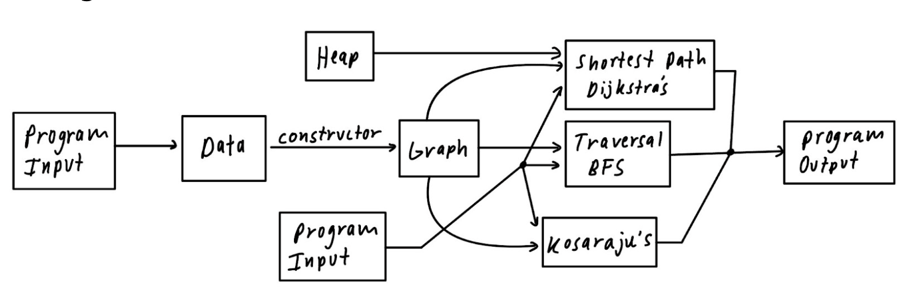

# CS225 Final Project: WikiRace

  <a href="#presentation-video">Presentation Video</a> •
  <a href="#data">Data</a> •
  <a href="#repo-structure">Repo Structure</a> •
  <a href="#running-instructions">Running Instructions</a> •
  <a href="#team">Team</a>

## Data

We are using the [Wikipedia network of top categories](https://snap.stanford.edu/data/wiki-topcats.html) data and focusing on the following two files:

- [Hyperlink network of Wikipedia](https://snap.stanford.edu/data/wiki-topcats.txt.gz)
- [Names of the articles](https://snap.stanford.edu/data/wiki-topcats-page-names.txt.gz)

## Repo Structure

### Deliverables

- All major files that contain our functions and classes are in the [`/src`](https://github.com/DylanDunham03/WikiRace-225FinalProject/tree/main/wikirace/src). The structure of how those files/classes interact with our project is outlined in the [Project Structure](#project-structure) below.
- The “wiki-topcat” dataset pulled from Stanford SNAP is stored in [`/data`](https://github.com/DylanDunham03/WikiRace-225FinalProject/tree/main/wikirace)  once you make the folder and import the .txt files as in the [Running Instructions](#running-instructions). The “small” and “medium” datasets used in testing are stored in [`.test-data`](https://github.com/DylanDunham03/WikiRace-225FinalProject/tree/main/wikirace/test_data). All data is stored in .txt files
- Testcases are in the [`/tests`](https://github.com/DylanDunham03/WikiRace-225FinalProject/tree/main/wikirace/tests)
- The written project report, development log, contract, and project proposal are in the [`/Documents`](https://github.com/DylanDunham03/WikiRace-225FinalProject/tree/main/Documents)

### Project Structure

  

## Running Instructions

### Setting up 
1. Open up your Terminal
2. `cd` into the folder containing cs225 Dockerfile
3. `git clone https://github.com/DylanDunham03/WikiRace-225FinalProject.git`
4. `cd WikiRace-225FinalProject/wikirace`
5. `mkdir data`
6. Download the two .txt files [here](https://drive.google.com/drive/folders/1n6MIdoUR8Jymwy0taQ4BBBIdNCVNGVSm?usp=share_link) to use our data set
7. Drag them into the `data` folder you just created in step 5
    - If you want to use other data sets, move it into this `data` folder as well
8. `mkdir build`
9. `cd build`
10. `cmake ..`
11. If you want to run the algorithms, skip to the [Executable](#executable) part. If you want to run the test suites, skip to the [Tests](#tests) part.

### Executable
1. From the build directory, run `make main`
2. Run `./main (path to data labelling connections between pages) (path to data containing ID and name) (path to output file)`
    - For example, `./main ../test_data/test_data_medium.txt ../test_data/test_name_medium.txt ./output.txt`
3. Answer the sequence of questions prompted on the terminal (an example is shown below):	
4. Upon successful run, you’ll see the following message:

### Tests
1. From the build directory, run `make test`
2. Run `./test` to run all test cases, or run each individual test by running `./test (test_case_name)`
3. Upon successful run, you’ll see the following message (it might take a while):

## Team

- Dylan Dunhan (`dylanad2`)
- Rachanon Petchoo (`petchoo2`)
- Chris Deng (`zdeng14`)
- Shubham More (`svmore2`)

